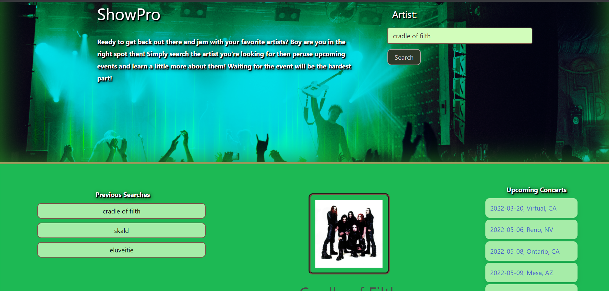

# ShowPro

## Purpose
A website that allows the user to search an artist which will present them with a list of upcoming events they can click to open a webpage to purchase tickets through. They will also be presented with information about the artist alongside these events including a picture and the artist's bio. Finally, a history of their searches will be preserved on their device so if they want to quickly revist a previously searched artist they can simply click on the relevent history link.

## Built With
* HTML
* CSS (https://bulma.io/)
* JavaScript

## APIs
* https://www.theaudiodb.com/
* https://seatgeek.com/

## Screenshot

## Website
https://BlinkingHeimdall.github.io/show-pro/

## Contribution

* Ben Milner: https://github.com/Bmilner88
* Holdan McMullen: https://github.com/Draxion2
* Jason Adams: https://github.com/BlinkingHeimdall
* Matthew Rogers: https://github.com/Vrentadax